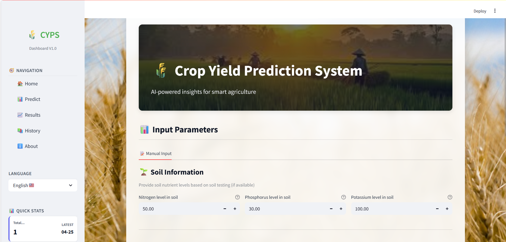
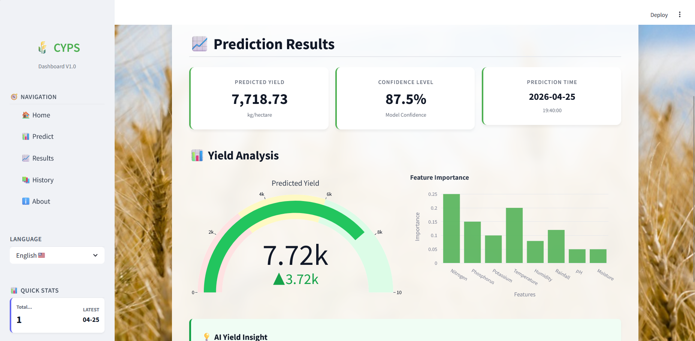

# 🌾 AI Crop Yield Prediction System (CYPS)


## 📌 Overview
The Crop Yield Prediction System is a high-performance machine learning application designed to forecast agricultural yields based on soil nutrients and environmental conditions. 

Unlike traditional neural networks, this system utilizes an **Extreme Learning Machine (ELM)** architecture. By relying on a Single-hidden Layer Feedforward Network (SLFN) where input weights are randomly assigned and output weights are analytically determined, the engine achieves rapid training times and high generalization without the computational overhead of backpropagation.

## 📸 System Interface

**Main Dashboard & Predictive Input**
 

**Prediction Results & AI Yield Insights**



## 🏗️ System Architecture
The codebase follows a strict separation of concerns, decoupling the machine learning engine from the user interface.

```text
ELM-PREDICTOR/
├── app/            # Streamlit UI, UI components, and i18n language management
├── assets/         # Static CSS styling and image assets
├── core/           # Core ML logic, ELM class, data preprocessing, and biological validation
├── data/           # Testing datasets and JSON test cases
├── models/         # Serialized model artifacts (.pkl)
└── tests/          # Accuracy and performance validation scripts
```

### 🧩 Core Modules Breakdown

The application is structured to ensure that the mathematical modeling is strictly isolated from the presentation layer.

#### 1. Core Machine Learning Engine (`/core`)
This directory contains the mathematical and logical backbone of the prediction system.
* `elm_engine.py`: Contains the primary `ExtremeLearningMachine` class. It handles the matrix operations for the hidden layer weight randomization and the Moore-Penrose pseudoinverse calculations for output weights.
* `data_processor.py`: Manages data ingestion, feature scaling, and one-hot encoding for categorical environmental variables.
* `validation.py`: Implements biological boundary checks to ensure inputs (e.g., soil pH, rainfall) and outputs remain within realistic agronomic parameters.

#### 2. User Interface (`/app`)
Built with Streamlit, this module handles all user interactions and state management.
* `main.py`: The entry point for the application. It orchestrates the flow between user inputs and the core engine.
* `ui_components.py`: Modularized UI widgets (sliders, drop-downs, charts) to keep the main script clean and readable.
* `language_manager.py`: Handles i18n (Internationalization) support, allowing the system to switch seamlessly between regional languages for diverse agricultural users.

#### 3. Model Artifacts (`/models`)
* `proven_elm_model.pkl`: The serialized, pre-trained ELM model weights, allowing for instant inference without retraining.
* `preprocessing_data.pkl`: Saved scalers and encoders to ensure user input data is transformed exactly as the training data was.

---

## 🚀 Quick Start & Installation

Follow these steps to run the Crop Yield Prediction System locally on your machine.

#### Prerequisites
Ensure you have **Python 3.9+** installed on your system.

#### 1. Clone the repository
```bash
git clone https://github.com/TruptiBhoir/crop-yield-elm-engine.git
cd crop-yield-elm-engine
```

#### 2. Create a Virtual Environment
```bash
python -m venv .venv
# On Windows:
.venv\Scripts\activate
# On macOS/Linux:
source .venv/bin/activate
```

#### 3. Install Dependencies
```bash
pip install -r requirements.txt
```

#### 4. Run the Application
```bash
streamlit run app/main.py
```
The application will automatically open in your default web browser. If it doesn't, navigate to http://localhost:8501 to view the CYPS dashboard.

---
### ✒️ About the Documentation
This repository serves as a live portfolio piece demonstrating enterprise-grade technical documentation.

If your software team struggles with messy codebases, outdated developer portals, or non-existent READMEs, poorly documented code is costing you user adoption and slowing down engineering velocity.

I help B2B SaaS and development agencies transform complex architecture into clear, marketable technical documentation.

* GitHub Profile: [github.com/TruptiBhoir](https://github.com/TruptiBhoir)

* Contact: trupti.bhoir002@gmail.com
